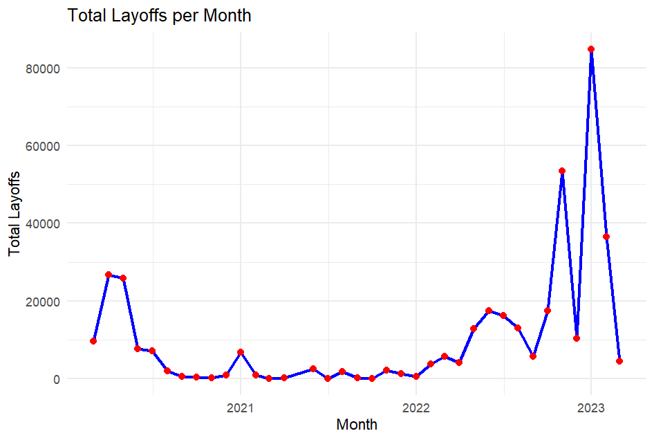

**SQL Layoffs Data Analysis**

SQL project for data cleaning and exploratory data analysis (EDA) of a global layoffs dataset.

This project demonstrates skills in:
* Handling duplicates, null values, and inconsistent formatting
* Exploratory Data Analysis (EDA) using SQL
* Time-series analysis with rolling totals
* Advanced queries with window functions

---

**📂 Project Structure**
* layoffs_cleaning.sql → Script for cleaning raw layoffs dataset
* eda_layoffs.sql → Exploratory Data Analysis queries
* screenshots/ → Folder containing charts and query outputs
* README.md → Project documentation

---

**🛠️ Data Cleaning Steps**
* Remove duplicates
* Handle NULL and blank values
* Standardize formats (company, industry, country)
* Convert date column into proper format

---

**📊 Exploratory Data Analysis (EDA)**

**1. Layoffs Over Time**

Total layoffs aggregated per year and per month.




**2. Layoffs by Industry**

Identifying which industries were most impacted.

**3. Layoffs by Country**

Distribution of layoffs across countries.

**4. Layoffs by Company Stage**

Comparison of layoffs across funding stages (Startup, Series A, Series B, etc.).

**5. Top 5 Companies per Year**

Using DENSE_RANK() to identify companies with the highest layoffs each year.

---

**📈 Key Insights**
* The peak of layoffs occurred in **[year X]**, with over **[N layoffs]**.
* **[Industry Y]** was the most affected, followed by **[Industry Z]**.
* **[Country A]** accounted for the highest layoffs globally.
* Companies at the **[Stage]** funding stage were disproportionately impacted.

---

**🚀 Tech Stack**
* **SQL** (MySQL) for data cleaning and EDA
* **GitHub** for version control and portfolio presentation

---

**▶️ Usage**
1. Clone this repository to your local machine:
   ```bash
   git clone https://github.com/username/layoffs-sql-analysis.git
   
   cd layoffs-sql-analysis

2. Import the **layoffs dataset** (layoffs.csv) into MySQL.

3. Run the **data cleaning script**:
   ```sql
   SOURCE layoffs_cleaning.sql;

4. Run the **exploratory data analysis (EDA) script**:
   ```sql
   SOURCE eda_layoffs.sql;

5. Explore the query outputs in **MySQL Workbench** or the **command-line client**.

